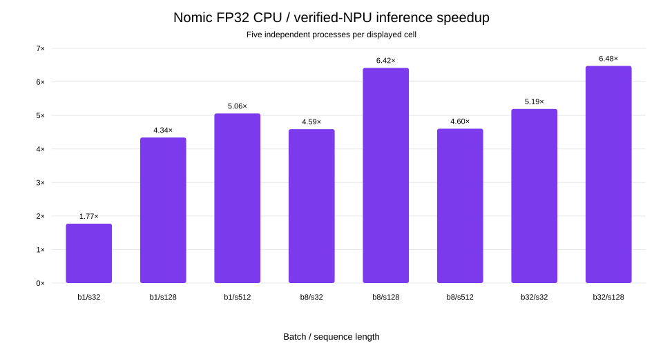
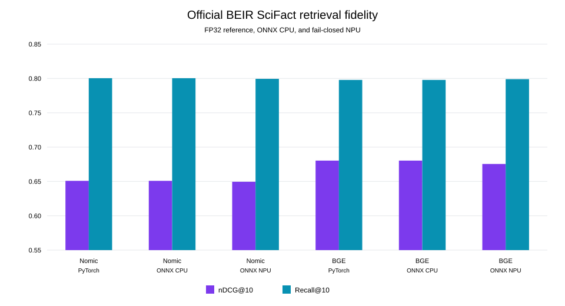

# Ryzen AI 1.8 embedding results

Snapshot: `rai180-20260813`

This study tests two BERT-family text encoders on one Lenovo laptop with an AMD
Ryzen AI 7 PRO 350 and XDNA2 NPU. The main Nomic matrix uses Ryzen AI 1.8,
five independent processes per reported cell, 20 warmups, and 100 timed
iterations. NPU-labelled results are accepted only when the VitisAI assignment
report contains NPU nodes and at least one NPU subgraph.

The result is useful but narrow. It shows that this NPU can accelerate the two
tested encoders at several static shapes without materially changing SciFact
retrieval quality. It does not establish performance on other machines, model
families, power profiles, SDK versions, or sustained thermal conditions.

## Machine and controls

| Field | Recorded value |
|---|---|
| System | Lenovo 21TBCTO1WW |
| CPU | AMD Ryzen AI 7 PRO 350, 8 cores and 16 logical processors |
| NPU | AMD XDNA2, NPU Compute Accelerator Device |
| RAM | 67,799,531,520 bytes |
| OS | Windows 11 Pro 10.0.26200 |
| NPU driver | 32.0.20101.3760 |
| SDK | Ryzen AI 1.8.0 |
| Power | AC, Windows Balanced profile |
| CPU runtime settings | ORT sequential, 8 intra-op threads, 1 inter-op thread |

Codex, Firefox, Chrome, WSL, and a resident llama-server hosting an embedding
model and a reranker were present when the environment snapshot was taken. The
llama-server processes and WSL used no CPU during the five-second observation,
but this was not a controlled lab machine. The CPU confidence intervals
reflect that reality.

Light interactive use was visible in the timing dispersion. Across the eight
confirmatory CPU groups, the coefficient of variation of process means ranged
from 12.2% to 33.0%, with a 25.9% median. NPU groups were usually tighter at
2.1% to 6.3%; batch 8, sequence 512 was the exception at 42.1% and is already
called out below. As a conservative diagnostic, dividing each CPU confidence
interval's lower bound by the corresponding NPU interval's upper bound still
favored the NPU in all eight shapes, with the smallest ratio at 1.14x for batch
1, sequence 32. This is not a formal confidence interval for the speedup ratio,
so the tables retain both intervals and avoid a general hardware-ranking claim.

## Nomic performance matrix

The chart reports CPU mean latency divided by NPU mean latency. Values above
one favor the NPU. Each displayed bar uses five independent CPU processes and
five independent NPU processes.

| Batch | Sequence | CPU mean | NPU mean | NPU 95% CI | Speedup |
|---:|---:|---:|---:|---:|---:|
| 1 | 32 | 43.47 ms | 24.55 ms | 22.90 to 26.20 ms | 1.77x |
| 1 | 128 | 147.44 ms | 33.97 ms | 32.46 to 35.47 ms | 4.34x |
| 1 | 512 | 488.98 ms | 96.65 ms | 89.70 to 103.59 ms | 5.06x |
| 8 | 32 | 277.55 ms | 60.49 ms | 58.95 to 62.04 ms | 4.59x |
| 8 | 128 | 1000.06 ms | 155.82 ms | 146.36 to 165.29 ms | 6.42x |
| 8 | 512 | 3826.09 ms | 831.00 ms | 396.76 to 1265.25 ms | 4.60x |
| 32 | 32 | 863.22 ms | 166.25 ms | 153.71 to 178.78 ms | 5.19x |
| 32 | 128 | 3542.92 ms | 547.09 ms | 504.46 to 589.73 ms | 6.48x |

The NPU won all eight confirmatory comparisons. The widest NPU interval is at
batch 8, sequence 512, so its mean speedup should not be read as a precise
point estimate. Verified NPU node coverage was 99.09% at batch 1, sequence 32,
and 99.39% at the other shapes.

CPU batch 32, sequence 512 is censored. One randomized process exceeded the
predeclared 2,700-second bound. A separate long-ceiling extension completed two
processes with a 13.77-second mean, while the five-process NPU mean was 2.58
seconds. Two CPU samples are not enough for a confirmatory confidence interval,
so this corner is omitted from the speedup chart.

Cold NPU compilation and session creation took 358 to 1,789 seconds across the
static Nomic shapes. Warm-cache session creation was roughly 1.8 to 2.9 seconds.
Those startup costs are separate from the steady-state latency table.

## Retrieval fidelity

The fidelity study uses the official BEIR SciFact test split: 5,183 documents,
300 queries, and 339 positive relevance judgements. Corpus, query, and qrel
files are pinned by row count and SHA-256. The repository does not redistribute
the source corpus.

| Model and runtime | Minimum cosine vs PyTorch | Ranking Spearman | nDCG@10 | Recall@10 | NPU nodes |
|---|---:|---:|---:|---:|---:|
| Nomic PyTorch FP32 | 1.000000 | 1.000000 | 0.650913 | 0.800389 | n/a |
| Nomic ONNX CPU FP32 | 1.000000 | 1.000000 | 0.650913 | 0.800389 | n/a |
| Nomic ONNX NPU FP32 | 0.997191 | 0.998508 | 0.649473 | 0.799389 | 652/656 |
| BGE PyTorch FP32 | 1.000000 | 1.000000 | 0.680341 | 0.797889 | n/a |
| BGE ONNX CPU FP32 | 1.000000 | 1.000000 | 0.680341 | 0.797889 | n/a |
| BGE ONNX NPU FP32 | 0.999273 | 0.999421 | 0.675451 | 0.799000 | 450/455 |

Both NPU paths passed the thresholds committed before these runs. Nomic encoded
the 5,483 SciFact items in 207.9 seconds on NPU and 586.4 seconds on ONNX CPU at
batch 1, sequence 128. BGE used batch 32, sequence 128 and took 23.7 seconds on
NPU versus 121.8 seconds on ONNX CPU. These stage times include the corpus and
queries but are not substitutes for the controlled latency matrix.

## BGE generalization corners

`BAAI/bge-small-en-v1.5` was pinned at revision
`5c38ec7c405ec4b44b94cc5a9bb96e735b38267a`. The exporter uses CLS pooling and
the model's documented retrieval instruction for queries. PyTorch to ONNX
export cosine was at least 0.99999994 at all three shapes.

| Batch | Sequence | CPU mean | NPU mean | Single-process ratio | NPU nodes |
|---:|---:|---:|---:|---:|---:|
| 1 | 32 | 6.35 ms | 8.74 ms | CPU 1.38x faster | 450/455 |
| 32 | 128 | 611.74 ms | 126.47 ms | NPU 4.84x faster | 450/455 |
| 1 | 512 | 96.63 ms | 34.84 ms | NPU 2.77x faster | 450/455 |

These are single-process exploratory timings with 5 warmups and 20 timed
iterations. They demonstrate shape support and a plausible crossover, not a
second confirmatory performance matrix. First-use NPU compilation and session
creation took 136 to 173 seconds.

## Dynamic INT8 negative result

The per-channel dynamic weight-only INT8 candidate was rejected. On the compact
NanoSciFact gate, minimum cosine was 0.970483 against a 0.98 threshold, and
Recall@10 fell from 0.86 to 0.81. Its VitisAI assignment report contained zero
NPU nodes. The thresholds were not relaxed, and INT8 is excluded from the
performance chart.

## Qwen3 compatibility

The controlled Qwen3 reproducer used the cached
`Qwen/Qwen3-Embedding-0.6B` snapshot at revision
`97b0c614be4d77ee51c0cef4e5f07c00f9eb65b3`. It built FP16 OGA DirectML models,
partitioned them with the SDK hybrid tool, and probed generation with hidden
states disabled and enabled.

| SDK | OGA package | Hidden states | Build | Hybrid partition | Probe |
|---|---|---:|---:|---:|---|
| 1.7.1 | 0.11.2 | off | pass | pass | logits shape mismatch |
| 1.7.1 | 0.11.2 | on | pass | pass | logits shape mismatch |
| 1.8.0 | 0.14.0 | off | pass | pass | hybrid model dtype rejection |
| 1.8.0 | 0.14.0 | on | pass | pass | hybrid model dtype rejection |

Ryzen AI 1.7.1 produced logits with shape `{1,1,151669}` where the runtime
requested `{1,15,151669}`. Ryzen AI 1.8.0 rejected a `tensor(float16)` input to
`SkipSimplifiedLayerNormalizationBf` while loading the hybrid model. Hidden
states did not change either outcome. This controlled FP16 path is not the
canonical AWQ flow, so the result does not settle every Qwen3 route.
The commands, exact package matrix, minimal failure signatures, and untested
boundaries are documented in
[`qwen3-compatibility.md`](qwen3-compatibility.md).

## Published artifacts

The reviewed bundle is in
[`benchmarks/results/published/rai180-20260813`](../benchmarks/results/published/rai180-20260813).
`manifest.json` hashes every published file and its local raw source. The bundle
contains aggregate tables and compact fidelity and compatibility records. Raw
per-iteration results and sanitized compiler logs are packaged by
`python tools/build_raw_release.py` as a deterministic release attachment.
Embeddings, model binaries, tokenizer copies, and NPU caches remain excluded.

## Limits on interpretation

- One machine was tested, without cross-machine replication.
- Resident desktop applications were present, and the Windows Balanced profile
  was used.
- Static shapes, CPU thread settings, driver version, and SDK version can change
  the result.
- No calibrated energy, power, temperature, or sustained-load measurement was
  taken.
- BGE timing samples are exploratory, and Nomic CPU batch 32, sequence 512 is
  censored.
- SciFact is a scientific-claims retrieval set, not a general proxy for all
  embedding workloads.
- Qwen3 remains incompatible in the tested controlled paths.
